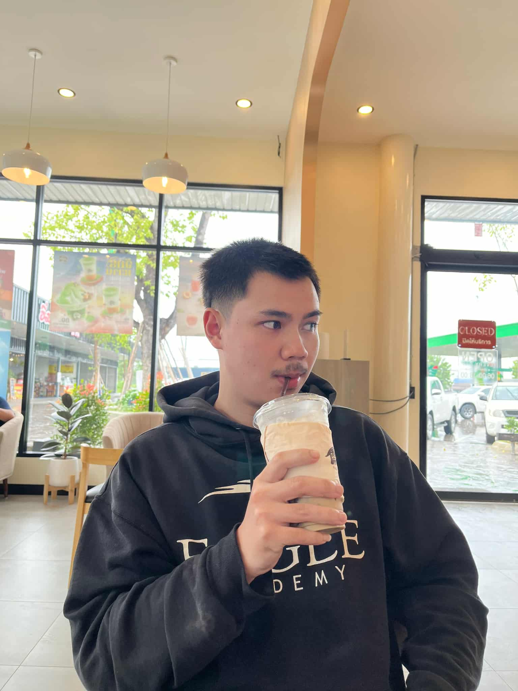
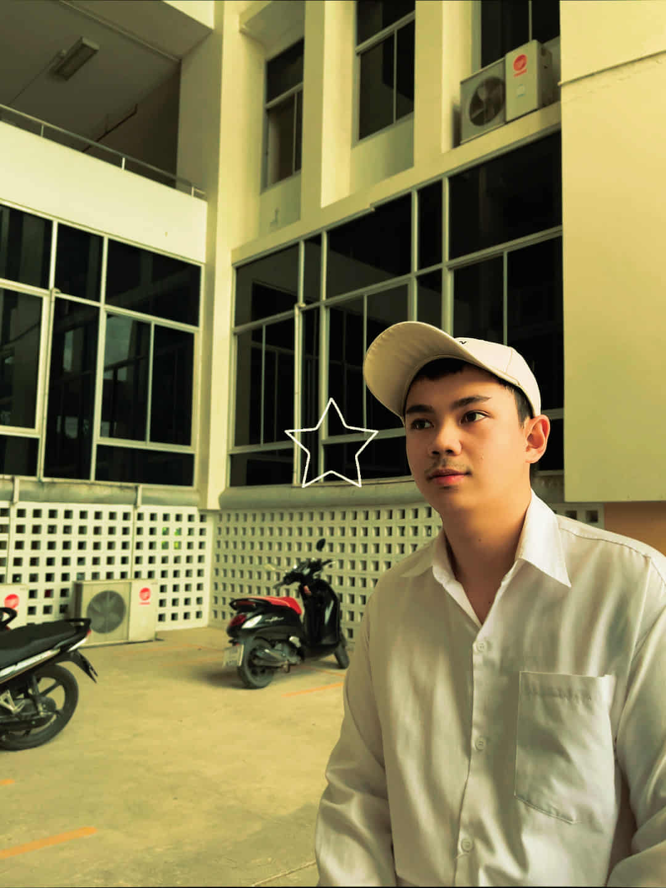
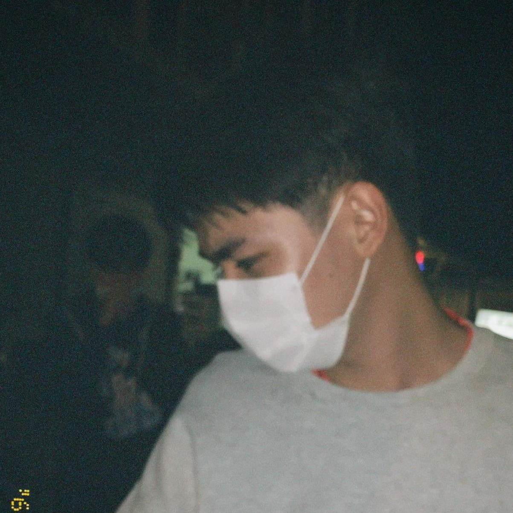

<!-- Profile Picture -->

  

<!-- Typing Animation -->

  

---

<h1 align="center">
  Hi, I’m Nirut Chanai 
  
</h1>

  <strong>Aspiring Front End Developer • Lifelong Learner</strong> 
  <em style="color:#555;">Turning ideas into clean, responsive, and interactive web interfaces.</em>

---

## 🚀 About Me

   
  🌱 <strong>Learning:</strong> Spring MVC · JSP · CSS · JavaScript   
  🛠 <strong>Stack:</strong> Frontend (HTML/CSS, JavaScript) | Backend (Java - Spring MVC) | Databases (MySQL)  
  🎨 <strong>UX/UI Tools:</strong> Figma · Canva   
  💻 <strong>Dev Tools:</strong> Eclipse · VS Code · GitHub   
  💡 <strong>Goal:</strong> <em>Seeking an opportunity in IT to grow technical skills, gain real-world experience, and contribute with teamwork & problem-solving.</em>

---

## 🧰 Tech Stack & Tools

  

---

## 📊 GitHub Stats

  
  

---

## 🎓 Education

🎓 <strong>Bachelor’s Degree:</strong> B.Sc. (Graduated 2025) 
🏫 <strong>University:</strong> Maejo University 
📍 <strong>Address:</strong> San Sai District, Chiang Mai, Thailand

---

## 💻 Featured Projects
<table align="center">
<tr>
<th>Project</th><th>Tech</th><th>Highlights</th>
</tr>
<tr>
<td>📚 Online Book Ordering System</td>
<td>HTML · CSS · JSP · JavaScript</td>
<td>Front-end for browsing & ordering books</td>
</tr>
<tr>
<td>🍽️ Restaurant Favorites Web App</td>
<td>JSP · JavaScript</td>
<td>Mark favorite restaurants & save</td>
</tr>
<tr>
<td>💅 Nail Salon Booking System</td>
<td>HTML · CSS · JSP</td>
<td>Customer booking interface</td>
</tr>
</table>

---

## 🗣 Languages

🇹🇭 Thai (Native) | 🇬🇧 English (Intermediate)

---

## 📝 Skills

<strong>Hard Skills:</strong> Programming (Basic) · UX/UI Design  
<strong>Soft Skills:</strong> Teamwork · Patience · Time Management

---

## 📫 Contact Me

   
  📍 Lamphun, Thailand 
  💌 <a href="mailto:nirut.chanai.dev@gmail.com">nirut.chanai.dev@gmail.com</a> 
  📞 +66 80-312-6797 
  🐦 GitHub: <a href="https://github.com/nirut-chanai">github.com/nirut-chanai</a>

---

<!-- Snake Animation -->

  

<!-- Divider Animation -->

  

